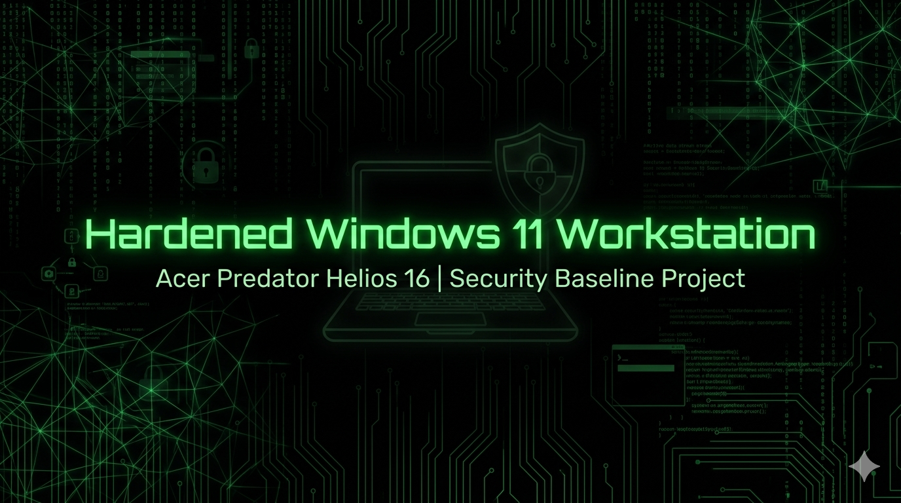

  

---

# Hardened-Acer-Windows 🛡️

## 📊 Security Posture Dashboard
| Component | Status | Last Audit |
| :--- | :--- | :--- |
| **Data at Rest (FDE)** | ✅ 100% Encrypted | 2026-04-26 |
| **Identity Protection** | ✅ TPM 2.0 + 48-digit Key | 2026-04-26 |
| **Network Perimeter** | ✅ Hardened (Spooler Disabled) | 2026-04-26 |
| **Platform** | 💻 Windows 11 Home | 2026-04-26 |

---

### 🏆 Milestones

> **Milestone Achieved:** The Acer Anchor is officially secured. Full Disk Encryption is verified, and the network attack surface has been reduced.

### Hardening Verification
| Initial Status (Vulnerable) | Hardened Status (Secured) |
| :--- | :--- |
> 🔍 **View the Full Audit:** [Detailed Side-by-Side Verification Data](docs/System_Baseline.md#audit-evidence-before-vs-after)

---

## 🎯 Objective
To transform a consumer-grade Windows 11 Home installation into a hardened management station. This project focuses on "Least Privilege" architecture, attack surface reduction, and protecting PII while managing remote Linux lab environments.

## 💻 Hardware Specifications
**Device Name:** Nicholas  
**Model:** Acer Predator Helios 16  
**OS:** Windows 11 Home (64‑bit)  
**Processor:** Intel Core i7‑14700HX (20C/28T, 2.10 GHz)  
**Memory:** 64 GB DDR5 (63.7 GB usable)  
**Graphics:**  
  - NVIDIA GeForce RTX 4070 Laptop GPU (8 GB)  
  - Intel UHD Graphics (128 MB)  
**Storage:** 1 TB NVMe SSD (303 GB used / 954 GB total)  
**System Type:** x64‑based processor  
**Pen & Touch:** None  
**Device ID:** B061E7CC-C0D3-4CD5-A882-D5AE32AB0E4F  
**Product ID:** 00342-21216-55087-AAOEM  

## 🛠️ Hardening Pillars
1. **Identity:** Transitioning from Administrative to Standard User daily-driver accounts.
2. **Data Integrity:** Utilizing Device Encryption and hardware-level protections.
3. **Network Defense:** Hardening Windows Firewall and disabling legacy protocols (NetBIOS/LLMNR).
4. **Telemetry Reduction:** Minimizing data outflow to external services.
