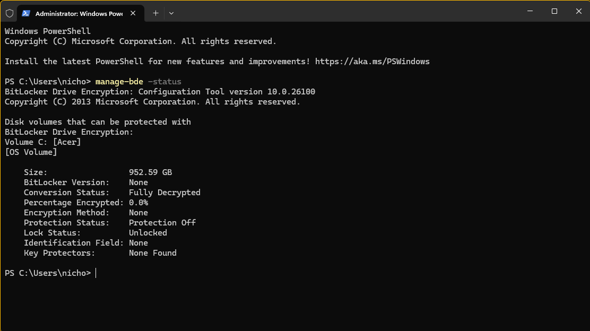
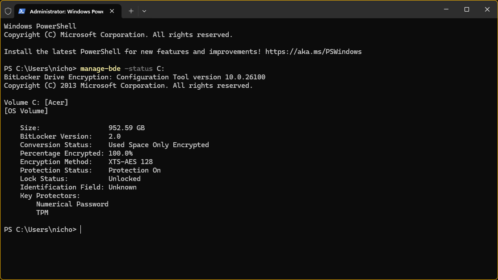

# System Baseline & Initial Security Audit

**Date:** 2026-04-26  

**Auditor:** Nicholas

## 1. Data at Rest (DAR) Audit
An initial audit of the primary OS volume was performed using `manage-bde`.

### **Audit Findings (Volume C:)**
* **Status:** 100.0% Encrypted
* **Protection:** ON (TPM + Numerical Password)
* **Risk Level:** LOW (Data-at-Rest)

**Vulnerability Assessment:** The system is now protected against offline attacks. Full Disk Encryption (FDE) ensures that physical theft of the device does not result in a compromise of data integrity or confidentiality.

---

### Audit Evidence (Before vs. After)

| Initial Status (Vulnerable) | Hardened Status (Secured) |
| :--- | :--- |
|  |  |
